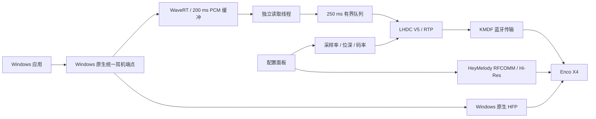

# 架构

## 音频路径与组件

`lhdc-transport.sys` 绑定目标 Audio Sink，枚举 `LHDCWIN\Audio` 子设备；`lhdc-audio.sys`（服务名 `lhdc-render`）提供 PortCls/WaveRT 播放路径。子设备继承真实蓝牙 ContainerId，拓扑使用 `KSNODETYPE_HEADPHONES`；内部 `WaveSpeaker`/`TopologySpeaker` 名称保留 KS 通道标识。没有 ROOT 声卡、模拟麦克风、回环或文件录音，受保护内容不导出。

音频框架由固定版本的 Microsoft SimpleAudioSample 在 `build/audio-reference` 准备单一播放路径，上游依赖保持原样。

生命周期修复：WaveRT miniport 持有适配器引用，音频流持有 miniport 引用；流析构先删除并等待通知定时器，再释放 miniport。PnP 清理同步解除适配器的 ETW 端口引用，再清空子设备缓存，避免循环引用。ETW 回调与接口替换通过旋转锁互斥。该修复对应 2026-10-09 内核崩溃，已安装并完成一分钟播放复测，长期稳定性与 PnP 生命周期仍需验证，见 [验证状态](status.md)。

## Hi-Res 控制

`src/control/` 独立实现 HeyMelody 控制协议。设备地址复用自动发现，按已知服务 UUID 由 Windows SDP 解析 RFCOMM 通道，不写死通道号。帧处理支持流式拆包、合包和 varint 长度；请求按命令与序号匹配，忽略无关通知，连接及每笔事务均有超时。

Hi-Res 查询为 `0x010D`、payload `01 18`；设置为 `0x0403`、payload `18 01/00`。只有设置响应成功且再次查询值一致才报告切换成功。未知值保留为未知，不能当成关闭。协议来源与归属见 [NOTICE](../NOTICE.md)。

开关改变后清除旧能力缓存并增加能力代次，服务重新建立 AVDTP 会话、读取真实能力；缓存代次不匹配时不向面板提供旧参数。高格式安装还会读回耳机 Hi-Res 状态。关闭前拒绝尚在使用高采样率/码率的配置，避免把当前音乐链路切到不支持的参数。内核 PCM 缓冲按最大 192 kHz / 24 位容纳 200 ms，实际容量仍按所选格式限制。

`LHDC-Win` 是 LocalSystem 自动服务，二进制位于仅管理员可写的 `%ProgramFiles%\LHDC-Win`。它管理活动控制台会话内的无窗口工作进程，以观察桌面应用的 Core Audio 通话状态。工作进程仍以 LocalSystem 运行；停止事件仅允许 SYSTEM/Administrators 访问，Job Object 在服务退出时回收进程，会话变化时重新建立。

## 格式与原生端点

`HKLM\SOFTWARE\LHDC-Win\Profile` 是严格校验的 12 字节 REG_BINARY，保存采样率、位深、码率。驱动只公布选定的一种立体声整数 PCM 格式；DEFAULT/RAW 首选格式、MODEDATAFORMATS 支持列表和数据范围一致。JACK_DESCRIPTION3 配置标识随采样率和位深改变，以刷新系统缓存。

Hi-Res 关闭时耳机的 AVDTP 能力为 `0100070d00ff3a050000354c3016114000`，开启后为 `0100070d00ff3a050000354c3506114000`，分别声明最高 48 kHz / 400 kbps 与 192 kHz / 1000 kbps。24 位使用三字节 PCM，服务核验真实输入与耳机能力，不增加音乐重采样。

码率还受单帧载荷预算限制：媒体通道申请最高 4096 字节 MTU，本机实际协商为 679 字节，减去 RTP/LHDC 头后为 665 字节。44.1 kHz / 1000 kbps 的编码帧需 682 字节，因此面板按实际 MTU 排除该组合，编码器在初始化前拒绝超限；没有实现帧分片。其他被允许的参数也不等于无线链路长期稳定。

格式切换先停止工作进程，再只重启目标音频子设备，在 20 秒窗口内核验真实适配器、格式和客户端连续可用 2 秒，之后启动服务。持续失败恢复 Windows 原生驱动；未连接时记录待验证状态。仅修改码率不重绑驱动。

### 码率调整

固定模式在完整编码包边界调用编码器的运行时码率接口，保持编码器、AVDTP 会话及 RTP 时序。新码率必须处于当前协商上下限内且单帧适合媒体 MTU，否则重新协商。例如 1000 kbps 建连后可直接切换 500/900/1000；400 kbps 建连后的上调需要重建会话。

`AdaptiveBitrate` 为独立的 REG_DWORD 开关（0/1），默认关闭；`Profile` 始终保存用户选择的上限，`ActiveBitrate` 发布实际播放码率，非播放状态清零。自适应使用当前编码表内、400 kbps 至所选上限的档位，起始最高 500 kbps（44.1 kHz 为 480）；上限不高于 400 时保持所选值。仅改变码率，不改变采样格式或扩大缓冲。

控制器每 100 ms 联合观察 PCM 积压与未完成发送的等待时间。PCM 达到 120 ms，或发送等待达到 40 ms 且 PCM 超过 80 ms，连续三次才降一档。PCM 达到 180 ms、出现新的丢弃，或发送等待达到 100 ms 且 PCM 超过 80 ms，视为严重拥塞：高档直接降至不高于 500 kbps 的实际档位，持续拥塞再降至 400。正常 60 ms 预缓冲、没有 PCM 积压的孤立发送延迟不触发降档。

发送反馈保留两次判断之间的等待峰值；已经完成但尚未从四包窗口回收的请求不计为拥塞。队列不高于 80 ms 持续 15 秒才升一档，降档后至少等待 30 秒再升档。变化在完整包边界应用并记录，不改变用户上限或采样格式。判断仍在发送返回后执行，不能撤回在途请求或消除已经发生的丢弃，也不能保证低于 400 kbps 所需吞吐的链路持续出声。

### MODEDATAFORMATS 布局

补全 `KSPROPERTY_PIN_MODEDATAFORMATS` 才使本机 24 位格式进入 Windows 原生端点归组。[微软文档](https://learn.microsoft.com/en-us/windows-hardware/drivers/stream/ksproperty-pin-modedataformats)正文与示例的偏移描述不一致；本机 Windows 28000 的实际消费布局经匹配公开符号和实测确认如下。

| 字节偏移 | 单格式回复 |
| --- | --- |
| 0 | `KSMULTIPLE_ITEM`，Size=120，Count=1 |
| 8 | `ULONG` 值 8，基址为头部之后的条目区 |
| 12 | 4 字节零填充 |
| 16 | 长度 104 的 `KSDATAFORMAT_WAVEFORMATEXTENSIBLE` |

使用 64 位偏移或整个头部作为基址曾导致 `AUDCLNT_E_UNSUPPORTED_FORMAT`。当前实现见 `drivers/audio/format_config.cpp`，适用范围是已验证的本机系统；其他版本需要重新验证。归组成功与实际 PCM、耳机听音分别核验。

## 缓冲与发送

起播正常预缓冲为 60 ms，每次读取最多 20 ms。独立读取线程负责 WaveRT 读取、PCM 表示转换和源重置，发送线程消费 250 ms 有界用户态队列，媒体 I/O 等待不直接阻塞读取。队列满时等待空间，由 200 ms 内核缓冲承接后续数据；空源使用高精度计时器轮询。读取错误传回消费者，格式代次变化停止读取，退出唤醒并回收等待线程。

启动或溢出恢复后追赶超过正常预缓冲的积压。超过两级缓冲容量的停顿仍会溢出，此时保留连接、编码器和 RTP，清理过期数据并恢复节拍。统计区分驱动丢弃 `kernel_dropped_bytes_total` 与重置主动丢弃 `discarded_pcm_bytes_total`，总和为 `dropped_bytes_total`。起播协商按现有策略清理过期数据，运行期零丢弃不证明全部起播样本都到达耳机。

媒体发送使用四包有界异步窗口，用户态与 KMDF 队列共用同一上限，按 RTP 顺序提交、从最早请求开始回收。窗口容量按包数限制，实际覆盖时长由每包帧数决定；八包候选未解决 900 kbps 卡顿，已撤回。请求独立持有缓冲、事件与 `OVERLAPPED`，正常结束排空窗口再关闭通道，异常回收等待取消完成后才释放内存。没有扩大 PCM 队列或隐式降低码率。

超过 100 ms 的发送记录 `submit_us`、`io_wait_us`、`completion_us`，周期和结束记录保存阶段最大值、读取间隔及队列峰值。异步窗口下，提交计时属于本次新包，等待及完成计时属于回收的最早包；不能把一次调用耗时当成单包端到端延迟。用户态等待还包含重新获得调度的时间，不能单凭它区分控制器、无线重传或耳机流控。进度日志在线程中写出，磁盘阻塞时合并快照。

驱动 WPP 记录媒体请求的提交、完成、字节数和未完成请求数，可按请求地址配对测量驱动内延迟。ACL 模式仅在启用对应追踪时查询，日常播放不额外发送查询 BRB。控制器发送额度和 HCI 完成事件由 Windows BthPort ETW 另行采集；完成计数不证明无线端没有重传或缺损。

## 音量与通话

Windows 硬件主音量/静音通过 AVRCP SetAbsoluteVolume 同步耳机；PCM 主增益为 1，耳机执行主音量衰减，应用音量仍由 Windows 管理。VolumeChanged 回写 Windows。起播读取耳机当前增益，重连不重复设置相同值，控制失败不静默切到满音量。

Windows 原生统一端点负责 HFP 路由及所需的 16 kHz 单声道转换。麦克风使用期间工作进程暂停 LHDC，结束后重建音乐传输。原生麦克风保持启用，项目不再向独立 HFP 输出转送音乐。

麦克风不连续标记与设备帧位置缺口分别记录；标记不直接等同于可听丢音，帧位置连续也不能排除底层补偿或无线缺损。当前对照与 ETW 结论见 [验证状态](status.md)。

## 传输与部署

软件枚举 Windows 已配对的 Audio Sink，以硬件 ID 和蓝牙设备名称识别 Enco X4，读取本机实例及地址。面板、服务和部署工具共用这一发现逻辑，不要求用户填写设备标识；没有匹配时报告未发现，多台匹配时报错，部署工具再次核验传入实例，避免误绑其他耳机。目标仍限定为已验证的 Enco X4 开发路径，不代表通用设备适配。

传输 ABI v3 位于 `include/lhdc_transport.h`。信令、媒体、AVRCP 的 ChannelId 为 1、2、3，各有独立队列，避免控制空读阻塞媒体。信令和 AVRCP 保持顺序队列；媒体最多四个 BRB 在途，队列级同步串行执行提交回调，完成回调通过状态锁更新计数。打开与关闭拒绝未完成的同通道操作。SDP 校验 Audio Sink 的 PSM 0x0019/AVDTP 与 AVRCP Target 的 PSM 0x0017；媒体要求信令已建立，AVRCP 可独立建连，回收顺序为 AVRCP、媒体、信令。

服务完成 Discover、能力交集、SetConfiguration/GetConfiguration、Open、Start 与结束回收。媒体首选 MTU 为 4096 字节，实际值以蓝牙协商结果为准，本机 Enco X4 当前返回 679 字节；RTP/LHDC 头占 14 字节。信令与 AVRCP 保留默认 MTU 偏好。AVRCP 50 ms 接收超时只取消当前读，不取消媒体发送；微软 AVRCP 与 HFP 设备保留。

`Set-AudioMode.ps1` 校验签名、目录成员和目标实例，仅操作自动发现的目标耳机。恢复 Windows 时停止并禁用服务、移除子设备、恢复 `BthA2dp / microsoft_bluetooth_a2dp_src.inf` 及原生访问权限/SRC 接口，然后核验双声道端点。部署状态位于 `%ProgramData%\LHDC-Win\deployment.json`，不依赖测试日志。

后台日志位于 `%ProgramData%\LHDC-Win\service.jsonl`，面板日志位于 `%LOCALAPPDATA%\LHDC-Win`。传输 WPP provider 为 `{67A00BC6-98CB-4A32-9CB0-50C97716C708}`，PDB/TMF 位于对应驱动构建目录。
